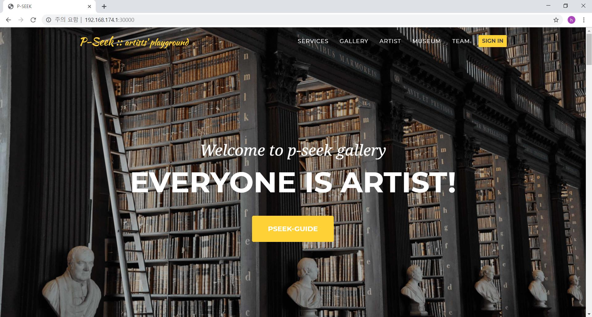

## P-SEEK
시공간적인 제한없이 미술작품을 관람하고 나만의 작품을 업로드하여 작품활동을 할 수 있는 온라인 미술작품 플랫폼.

### 슬로건
" 누구나 아티스트가 될 수 있다. "

### 프로젝트를 하게 된 동기
1. 전시정보가 부족하고 미술관이 멀리 떨어진 지역에 사는 사람들에게는 미술작품관람을 하기가 힘들다.
2. 무명의 아티스트들에게는 자신의 작품을 홍보할 수 있는 플랫폼이 부족하며 미술관 대관비용도 비싸다.

### 프로젝트 벤치마킹
- 핀터레스트, 디뮤지엄

### 프로젝트 기술스택
- node.js
- bootstrap
- ejs
- mysql
- express

### 프로젝트 기능
1. 회원가입, 로그인
3. 작품 관람 페이지
4. 좋아요기능
5. 이용자별 작품 추천서비스
6. 이용자의 작품 등록
7. 작품 관리 페이지

### 프로젝트 기대효과
1. 예술업계 시장 활성화
2. 예술작품 대중성 향상
3. 예술가의 진입장벽 완화 
 

### 메인페이지

### 프로젝트 팀
- 팀명: <b>PISA</b>(Programming IS Art)
- 유현지(팀장), 박병기(팀원), 위현승(팀원)

### Related
- [ImageViewer](https://github.com/fengyuanchen/viewer)
- [Make-dir](https://github.com/sindresorhus/make-dir)
- [Express-fileupload](https://github.com/richardgirges/express-fileupload/tree/master/example)
